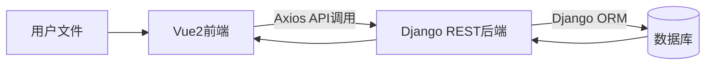
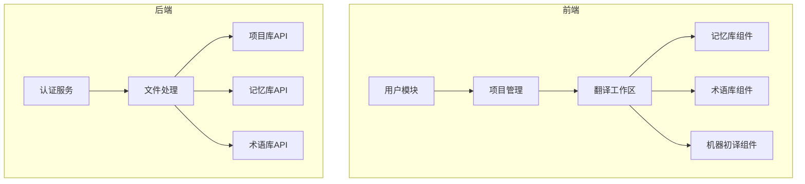
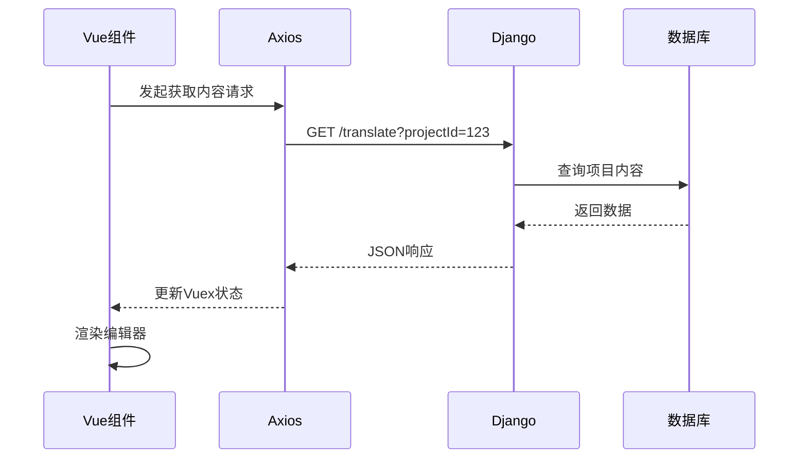
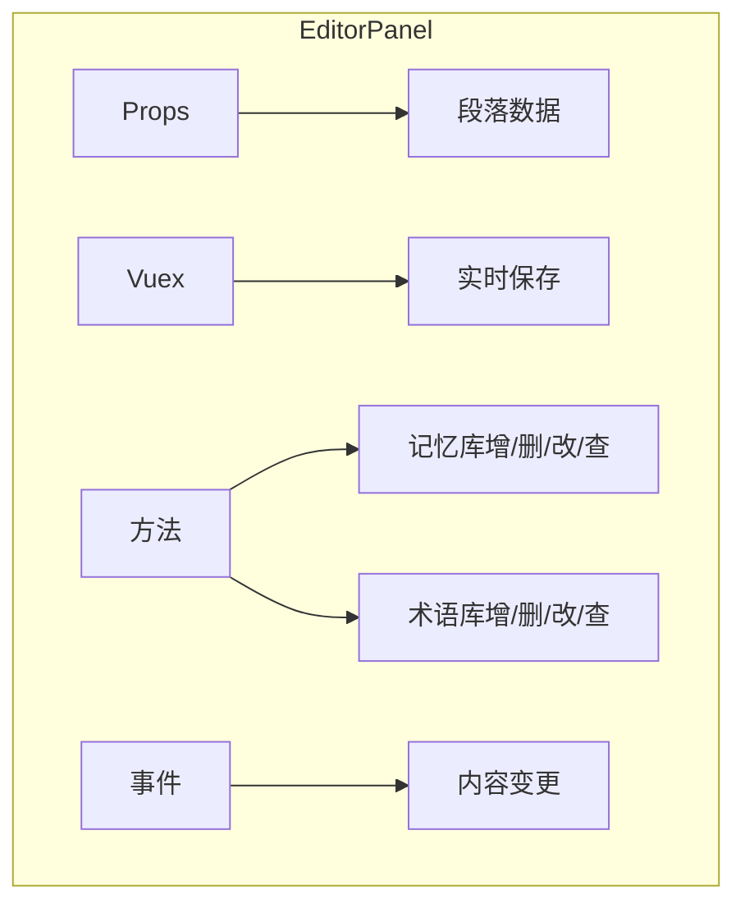
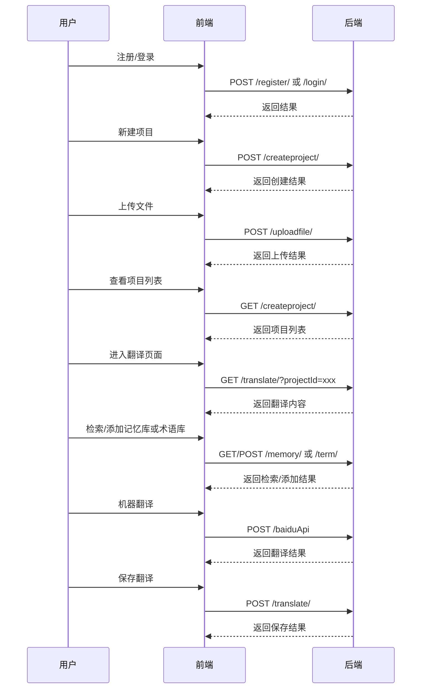
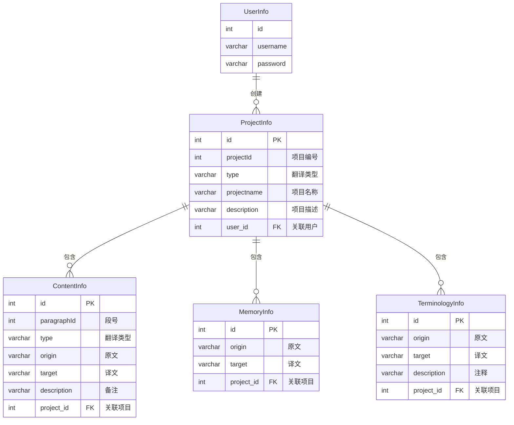
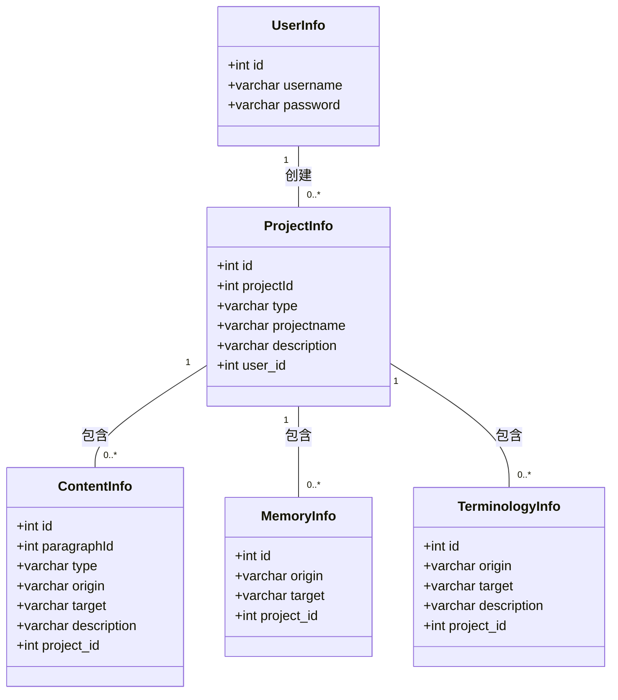
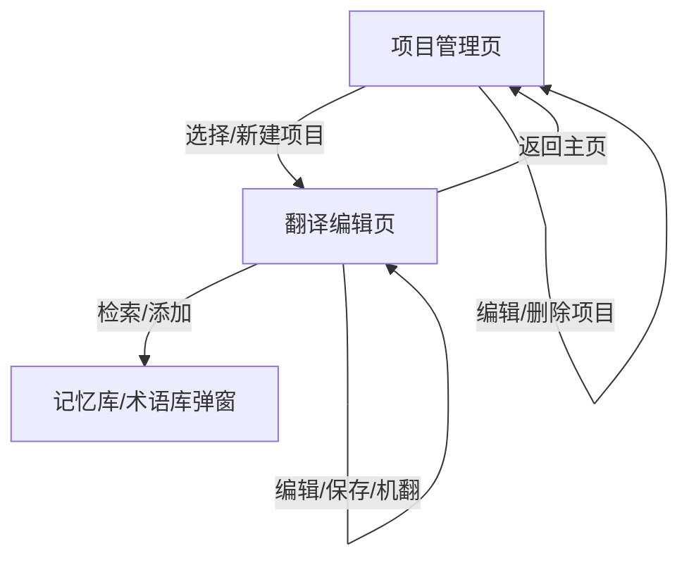

# 辅助翻译系统设计文档

## 1. 系统架构设计

### 1.1 整体架构


### 1.2 技术栈
| 层级         | 技术选型                                                     |
| ------------ | ------------------------------------------------------------ |
| **前端**     | Vue2 + Vuex + Vue Router + Element UI + Axios + WebSocket    |
| **后端**     | Django + Django REST Framework + Django Channels（WebSocket） |
| **构建工具** | Webpack + Vue CLI                                            |
| **测试**     | Jest（前端单元测试） + pytest（后端测试）                    |

### 1.3 模块划分


### 1.4 系统工作时序图（典型情况）




## 2. 前端详细设计

### 2.1 项目结构
```
src/
├── assets/                # 静态资源
├── components/            # 公共组件
│   ├── EditorPanel.vue     # 翻译编辑器
│   ├── MemoryPanel.vue     # 记忆库面板
│   └── TermPanel.vue       # 术语面板
├── views/                 # 页面视图
│   ├── Login.vue           # 登录页
│   ├── Projects.vue        # 项目列表
│   └── Translation.vue     # 翻译工作台
├── store/                 # Vuex状态管理
│   ├── modules/
│   │   ├── auth.js        # 认证模块
│   │   └── project.js     # 项目数据
│   └── index.js
├── router/                # 路由配置
├── api/                   # API服务封装
│   ├── auth.js           # 认证接口
│   └── translation.js    # 翻译相关接口
└── utils/                # 工具函数
```

### 2.2 核心组件设计

#### 翻译编辑器组件


### 2.3 状态管理设计

#### Vuex Store结构
```javascript
// src/store/index.js
import Vue from 'vue';
import Vuex from 'vuex';

Vue.use(Vuex);

export default new Vuex.Store({
  state: {
    selectedPrjId: 0,
    selectedPrjName:''
  },
  mutations: {
    setSelectedPrjId(state, id) {
      state.selectedPrjId = id;
    },
    setSelectedPrjName(state,name){
        state.selectedPrjName = name;
    }
  },
  actions: {
    updateSelectedPrjId({ commit }, id) {
      commit('setSelectedPrjId', id);
    },
    updateSelectedPrjName({ commit }, name) {
      commit('setSelectedPrjName', name);
    }
  },
  getters: {
    getSelectedPrjId: state => state.selectedPrjId,
    getSelectedPrjName: state => state.selectedPrjName
  }
});
```


## 3. 接口设计

### 3.1. 系统概述

本系统为辅助翻译平台，支持用户注册、登录、项目管理、文件上传、翻译编辑、术语库与记忆库管理等功能。前端采用 Vue + Element UI，后端通过 RESTful API 提供数据服务。

------

### 3.2.接口总览

#### 1. 用户相关接口

| 接口名称 | 方法 | 路径       | 说明     |
| -------- | ---- | ---------- | -------- |
| 注册     | POST | /register/ | 用户注册 |
| 登录     | POST | /login/    | 用户登录 |

#### 2. 项目管理接口

| 接口名称      | 方法 | 路径            | 说明           |
| ------------- | ---- | --------------- | -------------- |
| 获取项目列表  | GET  | /createproject/ | 获取用户项目   |
| 创建/删除项目 | POST | /createproject/ | 创建或删除项目 |

#### 3. 文件上传接口

| 接口名称 | 方法 | 路径         | 说明         |
| -------- | ---- | ------------ | ------------ |
| 上传文件 | POST | /uploadfile/ | 上传项目文件 |

#### 4. 翻译内容接口

| 接口名称     | 方法 | 路径        | 说明             |
| ------------ | ---- | ----------- | ---------------- |
| 获取翻译内容 | GET  | /translate/ | 获取项目翻译内容 |
| 保存翻译内容 | POST | /translate/ | 保存翻译内容     |

#### 5. 记忆库接口

| 接口名称   | 方法 | 路径     | 说明       |
| ---------- | ---- | -------- | ---------- |
| 检索记忆库 | GET  | /memory/ | 记忆库检索 |
| 添加记忆对 | POST | /memory/ | 添加记忆对 |

#### 6. 术语库接口

| 接口名称   | 方法 | 路径   | 说明       |
| ---------- | ---- | ------ | ---------- |
| 检索术语库 | GET  | /term/ | 术语库检索 |
| 添加术语   | POST | /term/ | 添加术语   |

#### 7. 机器翻译接口

| 接口名称 | 方法 | 路径      | 说明            |
| -------- | ---- | --------- | --------------- |
| 机器翻译 | POST | /baiduApi | 百度翻译API代理 |


### 3.3 典型交互流程

#### 接口调用流程图




## 4.数据库设计

### 4.1. 数据库表概述

该数据库系统包含5个主要表：

- 用户信息表 (UserInfo)
- 用户项目表 (ProjectInfo)
- 项目内容表 (ContentInfo)
- 翻译记忆库表 (MemoryInfo)
- 翻译术语库表 (TerminologyInfo)

### 4.2. 详细表结构

#### 2.1 用户信息表 (UserInfo)

| 字段名   | 类型    | 长度 | 说明   | 备注     |
| -------- | ------- | ---- | ------ | -------- |
| id       | Integer | -    | 主键   | 自动生成 |
| username | VARCHAR | 32   | 用户名 | 必填     |
| password | VARCHAR | 32   | 密码   | 必填     |

#### 2.2 用户项目表 (ProjectInfo)

| 字段名      | 类型    | 长度 | 说明           | 备注        |
| ----------- | ------- | ---- | -------------- | ----------- |
| id          | Integer | -    | 主键           | 自动生成    |
| projectId   | Integer | -    | 项目编号       | 必填        |
| type        | VARCHAR | 16   | 翻译类型       | 必填        |
| projectname | VARCHAR | 32   | 项目名称       | 必填        |
| description | VARCHAR | 256  | 项目描述       | 默认为空    |
| user_id     | Integer | -    | 外键(关联用户) | CASCADE删除 |

#### 2.3 项目内容表 (ContentInfo)

| 字段名      | 类型    | 长度 | 说明           | 备注        |
| ----------- | ------- | ---- | -------------- | ----------- |
| id          | Integer | -    | 主键           | 自动生成    |
| paragraphId | Integer | -    | 段号           | 必填        |
| type        | VARCHAR | 16   | 翻译类型       | 必填        |
| origin      | VARCHAR | 1000 | 原文           | 必填        |
| target      | VARCHAR | 1000 | 译文           | 默认为空    |
| description | VARCHAR | 256  | 备注           | 默认为空    |
| project_id  | Integer | -    | 外键(关联项目) | CASCADE删除 |

#### 2.4 翻译记忆库表 (MemoryInfo)

| 字段名     | 类型    | 长度 | 说明           | 备注        |
| ---------- | ------- | ---- | -------------- | ----------- |
| id         | Integer | -    | 主键           | 自动生成    |
| origin     | VARCHAR | 1000 | 原文           | 必填        |
| target     | VARCHAR | 1000 | 译文           | 必填        |
| project_id | Integer | -    | 外键(关联项目) | CASCADE删除 |

#### 2.5 翻译术语库表 (TerminologyInfo)

| 字段名      | 类型    | 长度 | 说明           | 备注        |
| ----------- | ------- | ---- | -------------- | ----------- |
| id          | Integer | -    | 主键           | 自动生成    |
| origin      | VARCHAR | 1000 | 原文           | 必填        |
| target      | VARCHAR | 1000 | 译文           | 必填        |
| description | VARCHAR | 256  | 注释           | 默认为空    |
| project_id  | Integer | -    | 外键(关联项目) | CASCADE删除 |

### 4.3. 表关系说明

1. UserInfo(1) ←→ ProjectInfo(n)：一对多关系
   - 一个用户可以创建多个项目
   - 每个项目必须属于一个用户
2. ProjectInfo(1) ←→ ContentInfo(n)：一对多关系
   - 一个项目可以包含多个内容段落
   - 每个内容段落必须属于一个项目
3. ProjectInfo(1) ←→ MemoryInfo(n)：一对多关系
   - 一个项目可以包含多个翻译记忆
   - 每个翻译记忆必须属于一个项目
4. ProjectInfo(1) ←→ TerminologyInfo(n)：一对多关系
   - 一个项目可以包含多个术语
   - 每个术语必须属于一个项目

### 4.4. 级联删除说明

所有外键关系都设置了CASCADE级联删除：

- 删除用户时，将删除该用户的所有项目
- 删除项目时，将删除该项目的所有内容、翻译记忆和术语

### 4.5. 字段长度限制

- 用户名和项目名称限制为32字符
- 翻译类型限制为16字符
- 描述和注释字段限制为256字符
- 原文和译文字段限制为1000字符

这个数据库设计适合用于翻译项目管理系统，支持多用户、多项目的管理，并包含翻译记忆和术语管理功能。6.

### 4.6. 示意图






## 5. 页面设计

### 5.1 翻译工作台界面
**布局说明**：





**关键功能点**：

1. **段落导航**：
   - 虚拟滚动优化（使用vue-virtual-scroller）
   - 状态颜色标识（未翻译/已保存/有备注）

2. **编辑区特性**：
   - 自动保存（防抖处理）
   - 术语自动高亮
   - 快捷键支持（Ctrl+Enter保存）

3. **辅助面板**：
   - 记忆库自动匹配
   - 术语即时查询
   - 用户自定义标记

### 5.2 响应式设计
| 屏幕尺寸   | 布局方案                   |
| ---------- | -------------------------- |
| > 1200px   | 三栏布局（列表+编辑+辅助） |
| 992-1200px | 折叠右侧面板               |
| < 992px    | 单栏布局，可展开侧边栏     |


